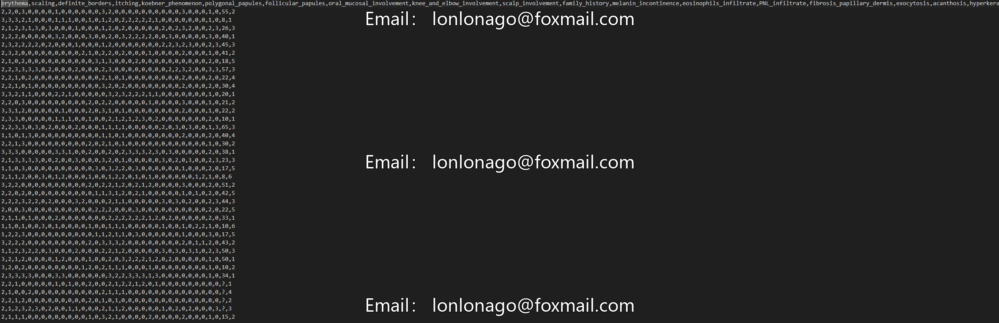

## Body

Dermatology Dataset (Multi-class Classification)

The differential diagnosis of "erythema and scale" diseases in dermatology is a real-world challenge. These diseases share similar clinical features, namely erythema and desquamation, with only minor differences. This category includes psoriasis, seborrheic dermatitis, lichen planus, rosacea, chronic dermatitis, and follicular dermatoses. Typically, diagnosis requires biopsy, but unfortunately, these diseases also share many common histological characteristics.

Firstly, 12 clinical assessments were conducted on patients. Subsequently, skin samples were collected to evaluate 22 histopathological features. The numerical values for these histopathological features were derived from the analysis of the samples under a microscope.

Feature Information
In this dataset for the field, if any such disease has occurred in the family, the "family history" feature value is 1, otherwise it is 0. The "age" feature simply represents the patient's age.
Each clinical feature and histopathological feature was assigned a numerical value between 0 and 3. 0 indicates that the feature does not exist, 3 indicates its maximum possible occurrence, and 1 or 2 indicate relative intermediate degrees.

Exploratory Approach
   Distribution of each attribute: explore the distribution of each attribute (column) in the dataset. You can use histograms or box plots to visually display the distribution of each attribute and identify any patterns or outliers.

   Correlation analysis: use correlation matrices to explore the relationships between different attributes in the dataset. This helps determine which attributes are most closely related and may be helpful in predicting the class label.

   Outlier analysis: study the missing values in the "age" attribute, represented by "?" in the dataset. Calculate the proportion of missing values and assess whether imputation is necessary.

   Category distribution: explore the distribution of class labels in the dataset. Use bar charts to show the number of instances for each category and judge whether the dataset is balanced or imbalanced.

   Featurization: consider creating new features that might help predict class labels. For example, you could create a feature that combines specific clinical attributes or histopathological attributes.

   Anomaly detection: check for any anomalies in the dataset. Anomalies can distort the data distribution and affect the performance of machine learning models. Visualize the distribution of each attribute using box plots or scatter plots and identify any potential anomalies.

## Images

Here is a pay link on Stripe ( https://buy.stripe.com/3cs8yP7sY87d0vu9AB ). Please contact me lonlonago@foxmail.com after funding $89, and I will send you a complete data files , thank you!

